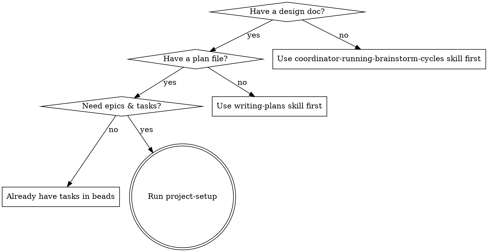

# Project Setup

Convert a plan file into beads epics and tasks with TDD-quality descriptions,
filled implementation prompts, and ready-to-use worktrees.

**Core principle:** Task descriptions are the source of truth. Each task is a
self-contained implementation guide — detailed enough for an agent to work
autonomously.

**Announce at start:** "I'm using the project-setup skill to decompose this plan
into epics and tasks."

## Phase 0 — Review gate (hard bail)

**This is the first gate and the ONLY structurally-enforceable gate in the
planning-skill review loop.** A `SKILL.md` is prose the agent follows; the
upstream wrapper's pre-flight greps are strong-but-soft behavioral guardrails.
This gate is different: project-setup is thrum-owned, so it is authored to
genuinely refuse to run.

Before doing anything else, verify the plan/spec doc carries a passing review
stamp, a Deviations-from-Source block, AND evidence that
`verify-against-source` specifically ran. Resolve the plan path first (it is
the skill's primary input — the same path the caller passes), then:

```bash
# PLAN_FILE = the plan/spec doc this project-setup run is decomposing
# Anchored, NOT -F: a bare substring match accepts an invented verdict —
# `verdict=Ready:Yes-with-residual` satisfies `grep -F 'verdict=Ready:Yes'`
# and walks straight through this fail-closed gate. The trailing group
# requires the value to END here.
grep -E 'THRUM-REVIEW: stage=plan verdict=Ready:Yes([[:space:]]|-->|$)' "$PLAN_FILE" \
  || grep -E 'THRUM-REVIEW: stage=plan verdict=OVERRIDE([[:space:]]|-->|$)' "$PLAN_FILE"

grep -F '## Deviations from Source' "$PLAN_FILE"

grep -E 'verify=Ready:Yes([[:space:]]|-->|$)' "$PLAN_FILE" \
  || grep -E 'verify=OVERRIDE([[:space:]]|-->|$)' "$PLAN_FILE" \
  || grep -E 'verify=PREDATES([[:space:]]|-->|$)' "$PLAN_FILE"
```

All three checks must pass.

Notes on the check:

- **Case-sensitive, literal match.** Use `grep -F` on the exact canonical
  (fixed-key-order) string. Never `grep -i`. The canonical verdict values are
  exactly `Ready:Yes` and `OVERRIDE` — a mis-cased stamp (`ready:yes`,
  `READY:YES`) does NOT pass.
- **`OVERRIDE` is a valid pass** for the THRUM-REVIEW stamp and for
  `verify=` — each independently. Neither substitutes for the Deviations
  marker. Surface any `THRUM-DEFER` lines still present in the doc as part
  of the override audit.
- **The Deviations block has no override.** Its absence always fails the
  gate — see `claude-plugin/commands/_deviations-protocol.md` ("empty must
  be WRITTEN, not omitted").
- **`verify=` has no silent-omission path.** A stamp missing `verify=`
  entirely FAILS this third check exactly like a missing stamp fails the
  first — there is no carve-out for plans that predate the field. The field
  must be PRESENT with one of exactly three values: `Ready:Yes` — the
  `verify-against-source` conformance pass ran clean this cycle; `OVERRIDE`
  — a coordinator deliberately waived `verify-against-source` for THIS
  review cycle (an active, in-the-moment waiver, with a reason); `PREDATES`
  — this plan/stamp predates the `verify=` convention entirely (the legacy
  case). Each is a distinct, auditable claim, and none of them is the same
  as leaving the field out. A plan reviewed before this convention existed
  must be re-stamped with `verify=PREDATES` (not `OVERRIDE` — that value is
  reserved for an active per-cycle waiver, not the legacy case) to pass,
  same as any other legacy plan bails on the first check until it gets an
  `OVERRIDE`. This is what makes `verify-against-source` mandatory in fact,
  not just in name: a plan could otherwise carry `verdict=Ready:Yes` from
  some OTHER reviewer while `verify-against-source` itself never ran.

If any check fails, **STOP — do not proceed.** Tell the user:

> project-setup requires the plan/spec to have passed the planning-loop review
> (or carry a coordinator override), to carry a `## Deviations from Source`
> block, AND to carry `verify=Ready:Yes`, `verify=OVERRIDE`, or
> `verify=PREDATES` evidence that `verify-against-source` specifically ran (or
> was deliberately waived, or the plan predates the convention). The plan at
> `<PLAN_FILE>` is missing one or more of: the review stamp, the Deviations
> block, the `verify=` field — check which with the three `grep -F` commands
> above. Run the plan review first (making sure `verify-against-source` runs
> and stamps `verify=`), obtain a coordinator override, or stamp
> `verify=PREDATES` if the plan predates this convention, then re-invoke
> project-setup.

**Fail closed, not open.** Plans that predate this feature, or that arrive from
a different flow, will not carry the stamp, the Deviations block, or the
`verify=` field — they still bail on all three checks. The caller must add an
`OVERRIDE` stamp for the review-stamp check and a `verify=PREDATES` (the
legacy case — not `verify=OVERRIDE`, which is reserved for an active per-cycle
waiver) for the verify check, and must author the Deviations block (there is
no override for its absence), to proceed. Do not silently fall through when
any of the three is absent.

## When to Use



**Don't use when:**

- No design doc exists yet — use the `coordinator-running-brainstorm-cycles`
  skill first (spawns a researcher in an isolated worktree, runs the brainstorm
  interactively with the user, iterates dual-review cycles, then hands off back
  to project-setup)
- No plan file exists yet — use writing-plans skill first
- Tasks already exist in beads — go straight to creating the implementation
  prompt closely following the template (implementation-agent.md)

## Prerequisites

Two prereqs must be satisfied before project-setup proceeds. Bail on either
rather than trying to work around it.

### Beads (bd) installed

Verify beads is installed:

```bash
bd version
```

If `bd` is not found, stop and tell the user:

> project-setup requires beads (`bd`) for task tracking with dependencies.
> Install it:
>
> ```bash
> brew install dolt                    # required dependency
> brew install steveyegge/beads/bd     # beads CLI
> bd init                              # initialize in your repo
> ```
>
> See the [beads repo](https://github.com/steveyegge/beads) for alternative
> install methods. Requires dolt v1.81.8+ and bd v0.59.0+.

Do not proceed without beads. Do not fall back to markdown task lists or
TodoWrite.

### Implementation Philosophy Doc

Verify the project has an implementation philosophy doc at the canonical path.
In worktrees, `.thrum/` is a redirect file pointing at the project root's real
`.thrum/` directory — the check must resolve through it:

```bash
PHILOSOPHY_DIR=.thrum
[ -f .thrum/redirect ] && PHILOSOPHY_DIR="$(cat .thrum/redirect)"
test -f "$PHILOSOPHY_DIR/philosophy.md"
```

If the file does not exist, stop and tell the user:

> project-setup requires a philosophy doc at `.thrum/philosophy.md`. Run the
> `project-philosophy` skill first to generate or locate one, then re-invoke
> project-setup.

Do not proceed without the philosophy doc. Do not inline-create.

If the doc exists, read it and extract the anti-patterns for injection in
Phase 4. Refer to the `project-philosophy` skill for the doc contents and the
anti-pattern format. Also check for `.thrum/hotpath-gate.json` (generated by
`project-hotpath-gate`); if absent, recommend running it alongside
`project-philosophy` at onboarding so the project has hot-path gate
configuration from day one.

## Inputs

Primary input: **plan file path** (output of writing-plans, e.g.
`dev-docs/plans/2026-02-21-feature-plan.md`). The plan references the design doc
— both are read in Phase 1.

Also needed from CLAUDE.md or conversation context:

- **Project root** — absolute path to the project
- **Tech stack** — languages, frameworks, tools in use
- **Quality commands** — test/lint commands (e.g. `make test && make lint`)
- **Coverage target** — minimum coverage threshold (e.g. `>80%`)

If any are missing, ask the user (prefer multiple choice when possible).

## Phase 1: Understand the Plan

Read the plan file and the design doc it references. Identify major phases,
components, data flow, and interfaces.

### 🔴 Phase 1a — MANDATORY security-frame check (do this BEFORE decomposing)

**Read the project's threat model** (`docs/security_model/master.md` §1 and §1.2
on thrum; otherwise `docs/security*.md` / `SECURITY.md`) **whenever the plan
contains ANY of the following — and note that NONE of them need name an
attacker:**

- a **guard**, cap, deadline, concurrency limit, backoff, or rate limit
- a **retention, permanence, immutability, or "must never be deleted/rotated"** rule
- an **audit, forensic, tamper-evidence, or provenance** requirement
- an **authorization, entitlement, or recipient/ownership check**

**Thrum's actual shape, which the plan must be read against:** **NOT SaaS, NOT
internet-facing, NOT product-oriented.** It is **single-user, localhost, and
multi-machine on the same network**. Capabilities are **owner toggles, not an
authorization system**. Every process with repo write access is **inside the
perimeter**. What is defended against is **agents making MISTAKES, not agents
ATTACKING**.

**If a plan requirement only makes sense under a SaaS / multi-tenant /
internet-facing / compliance frame, it is a DEFECT IN THE PLAN — surface it
before creating beads.** Do not decompose it into tasks; a bead makes an
unratified premise look like ratified scope, and every downstream hop then
reasons correctly from it.

🔴 **WHY THIS IS A PHASE AND NOT A REMINDER (thrum, 2026-07-24, four instances
in one session).** Requirements of this class do **not** arrive labelled
"security" — they arrive as durability, forensics, hygiene, or "defence in
depth". One example ran the whole chain: *"the audit lane must never be rotated,
purged, or synced, and must outlive the purge machinery"* was an **agent's
generalisation of an unrelated log's rotation failure**, ratified by nobody. It
passed through a coordinator twice, became a dispatch instruction, and was about
to become a **RED-first test pinning it as an executable invariant** — at which
point changing the policy would have meant arguing with a passing test. **A
conformance gate downstream cannot catch this: every hop reasons correctly from
a false root, so the chain looks clean at every step.** The check has to happen
where the premise ENTERS.

**Ask of any such requirement: WHO RATIFIED IT?** Trace it to an owner ruling or
the threat model. "It appears in the source plan" is propagation, not
ratification.

### The Two-Artifact System

This skill produces two complementary artifacts per task:

| Artifact              | Contains                                       | Authoritative For                   |
| --------------------- | ---------------------------------------------- | ----------------------------------- |
| **Beads task**        | Acceptance criteria, deps, status              | What must be true to close the task |
| **Plan file section** | Step-by-step code, file paths, verify commands | How to implement the task           |

Both are required. Agents read `bd show {TASK_ID}` first (what must be true),
then search the plan file for the matching `## Task: {BEAD_ID}` section (how to
get there).

**If the plan file lacks code for a task, the task description must be detailed
enough to stand alone.** Flag any plan tasks with vague or missing
implementation code during this phase.

Explore the codebase and recent beads state in parallel. Partition the work so:

- One sub-agent maps packages, interfaces, and patterns relevant to
  `{{FEATURE_DESCRIPTION}}` — output: `output/planning/codebase-scan.md`.
- One sub-agent runs `bd list --status=open`, `bd ready`, and `bd blocked` and
  identifies work related to `{{FEATURE_DESCRIPTION}}` — output:
  `output/planning/beads-context.md`. (Raw `bd ready` is deliberate here — this
  is a beads-state inventory alongside `bd list`/`bd blocked`, not work-queue
  pickup; the kt-ready migration covers pickup prose only.)

Invoke `efficient-multi-agent-research` for the launch-and-wait mechanics. After
agents complete, read the two output files — do not fan-read individual beads
entries into your main context.

Ask the user focused questions (prefer multiple choice) about anything the plan
leaves ambiguous — constraints, scope boundaries, patterns to follow.

## Phase 1b: Spec coverage gate (MANDATORY)

Invoke **`trace-spec-to-plan`** against the plan and its source spec. **Do not
create a single epic or task until every gap it reports is closed or explicitly
ruled by the owner.**

**Why HERE:** this is the last moment the spec is still in the room. Once a
requirement is missing from the plan *and* absent from the beads, **the beads
become the working set, nobody consults the spec again, and the gap stops being
discoverable at all.**

🚫 **You may not run it yourself if you authored the plan.** Self-review cannot
catch a requirement the author never perceived — same person, same anchoring,
same blind spot. **Dispatch it.**

⚠️ **This does NOT duplicate `verify-against-source`.** They read different
things and catch different failures:

| Gate | Reads | Asks | Catches |
|---|---|---|---|
| `verify-against-source` | the ARTIFACT | does this honor its source? | drift, contradiction, scope creep |
| **`trace-spec-to-plan`** | **the SPEC** | **where did each requirement land?** | **absence, name-only, missing substrate** |

**A reviewer reading an artifact cannot see what isn't in it.** Measured
2026-07-31: after eight prior audits — including two full Fable passes, a
three-axis review, and a mandatory conformance gate — this found **eight more**
gaps, among them an owner-ruled four-stage remediation posture with no task, no
test, and no mention anywhere in a 4,400-line plan. Nobody was careless; **there
was no text to be careless about.**

## Phase 2: Decompose into Epics & Tasks

### Map Plan Phases to Epics

Map each plan phase to a beads epic. Each epic should:

- Represent a cohesive, independently deliverable unit of work
- Be completable in 1-3 agent sessions
- Have clear boundaries (a single worktree/branch per epic)
- Map to a logical layer or component from the design spec

**Naming:** Imperative form — "Implement Sync Protocol", "Build Session
Manager", "Create Filter Component".

Present the epic breakdown to the user for approval before creating anything.

### Create Epics in Beads

Once the user approves the epic breakdown:

```bash
bd create --title="Epic Title" --type=epic --priority=1

# If epics have ordering dependencies:
bd dep add <later-epic-id> <earlier-epic-id>
```

### Create Tasks

When creating > 6 tasks, delegate to parallel sub-agents — one per epic. Each
sub-agent (sonnet-low is sufficient — the work is mechanical) gets the epic ID, the
list of `bd create --title=... --type=task --priority=N --description=...`
commands to run, the within-epic `bd dep add <later_id> <earlier_id>` ordering
commands, and instructions to return the created task IDs and titles. Invoke
`efficient-multi-agent-research` § Core Pattern for launch-and-wait mechanics.

> **Model tiers:** pass an explicit `model:` on every dispatch — `sonnet`
> (low effort) mechanical, `sonnet` (medium effort) judgment, Opus only on
> operator-ask or a skill step that names it. See the
> `choosing-subagent-models` skill for the full policy.

After sub-agents return IDs, set cross-epic dependencies directly (requires IDs
from multiple sub-agents):

```bash
bd dep add <epic-2-id> <epic-1-id>

# Verify no circular dependencies
bd blocked
```

### Task Description Quality

Every beads task description is a **self-contained implementation guide**:

**Required sections:**

````markdown
## Files

- Create: `exact/path/to/new_file.go`
- Modify: `exact/path/to/existing.go` (add XyzService interface)
- Test: `exact/path/to/new_file_test.go`

## Steps

### Step 1: Write the failing test

```go
func TestSpecificBehavior(t *testing.T) {
    result := Function(input)
    assert.Equal(t, expected, result)
}
```

### Step 2: Implement

```go
func Function(input Type) ReturnType {
    // implementation
}
```

### Step 3: Verify and commit

```bash
go test ./path/to/package/... -run TestSpecificBehavior -v
git commit -m "feat(module): add specific feature"
```

## Acceptance Criteria

- [ ] All tests pass
- [ ] Function handles edge case X
- [ ] Error returns are typed, not generic
````

**Scale code detail to task type:**

| Task Type            | Code in Steps            | Test Detail                                   |
| -------------------- | ------------------------ | --------------------------------------------- |
| API/Interface design | Full signatures + types  | Contract tests, error case tests              |
| Business logic       | Full implementation code | TDD: failing test → implement → pass          |
| Integration/Wiring   | Connection code + config | Integration test against mock/real dependency |
| UI/Styling           | Full CSS/component code  | Visual verification steps, screenshot check   |
| Testing-only         | N/A                      | Full test code with scenarios and edge cases  |
| Documentation        | N/A (outline only)       | Verification: doc renders, links work         |

**Granularity:** Each task should be completable in one focused session (30-90
minutes). If a task has more than 5 steps, split it.

### Ensure Refactoring Epic Exists

Implementation agents log DRY/refactoring opportunities they discover during
feature work. These go into a persistent **refactoring epic** in beads. Check if
one exists; if not, create it:

```bash
# Search for existing refactoring epic
bd list --type=epic | grep -i refactor
```

If found, note the epic ID — it will be referenced in the implementation
template's "Logging Refactoring Opportunities" section.

If not found, create one:

```bash
bd create --title="Refactoring & DRY Opportunities" --type=epic --priority=3 \
  --description="Persistent backlog for refactoring, DRY improvements, and code
organization opportunities discovered during feature work. Tasks are added by
implementation agents as they encounter opportunities. Reviewed and prioritized
by the coordinator periodically."
```

This epic is **project-wide and long-lived** — it persists across feature epics.
Do not close it when closing feature epics. Implementation agents find it via
`bd list --type=epic | grep -i refactor` and add tasks under it.

### Verify Setup

Everything the plan specifies must end up in a created epic/task — including
artifacts declared in a plan **section** body (e.g. shared types, helpers), not
only inside a task's own Files/Steps. Dispatch a sub-agent to audit the created
tasks against the full plan and confirm nothing was left unscheduled before
proceeding to Phase 3.

Before proceeding to Phase 3:

- [ ] Every task has a clear title and detailed description
- [ ] Task ordering within each epic makes sense (foundations first)
- [ ] Epic dependencies reflect the actual build order
- [ ] No circular dependencies (`bd blocked` should be clean)
- [ ] Each epic can be assigned to one worktree/branch
- [ ] Total scope is realistic (flag if > 20 tasks per epic)
- [ ] Sub-agent audit confirms every plan-declared artifact, including
      section-body declarations, is covered by some task

### Verify Plan File Anchors

After creating all tasks, verify the plan file has a searchable anchor for each
task. Implementation agents find their code by searching for:

```text
## Task: {BEAD_ID} — {Title}
```

For each created task, grep the plan file:

```bash
grep "## Task:" {{PLAN_FILE}} | head -20
```

Cross-reference against the created bead IDs. If any task lacks a matching
anchor, add it to the plan file at the corresponding section. This ensures
agents can search for their section instead of reading the entire (potentially
large) file.

### Detect Cross-Epic Dependencies

After setting all dependencies, scan for tasks that depend on tasks in OTHER
epics:

```bash
bd blocked
```

For each cross-epic dependency (where the blocker is in a different epic than
the blocked task), record:

| Blocked Task | Blocked By | Blocker's Epic |
| ------------ | ---------- | -------------- |

Save this map — it feeds Phase 4, where each implementation prompt will include
its epic's cross-epic dependencies so agents know exactly which external tasks
to check before starting blocked work.

If no cross-epic dependencies exist, note that and move on.

## Phase 3: Select Worktrees & Agents

**This phase is an interactive decision gate.** You MUST ask the user which
worktree and agent to use for each epic before generating prompts. Do not infer
silently — present options and let the user choose.

### Step 1: Gather Current State

Run these commands and present the results to the user:

```bash
# List all active worktrees with branches
git worktree list

# Check which worktrees have in-progress beads tasks
bd list --status=in_progress

# Check the CLAUDE.md worktree table for status info
# (read the "Worktree Layout" section from the project root CLAUDE.md)
```

### Step 2: Present Worktree Options

For each epic, use `AskUserQuestion` to let the user choose a worktree. Build
the options from the gathered state:

**Option types to present:**

| Scenario                                    | Option label                        |
| ------------------------------------------- | ----------------------------------- |
| Existing idle worktree with related branch  | "Reuse `<path>` (`<branch>`)"       |
| Existing idle worktree, unrelated branch    | "Reuse `<path>`, create new branch" |
| No suitable worktree exists                 | "Create new worktree"               |
| Work is small enough for the current branch | "Use current worktree (`<branch>`)" |

Include in each option's description:

- The worktree path and current branch
- Whether it's clean or has uncommitted changes
- Whether it has an existing agent registered
- Its status from CLAUDE.md (active/idle/merged)

**For "Create new worktree"**, suggest:

- Path: `~/.workspaces/{repo}/{feature}` (from CLAUDE.md convention)
- Branch: `feature/{feature-name}`, cut from the configured merge target
  (`jq -r '.orchestration.merge_target' .thrum/config.json`) — never a
  remembered branch name

**For agent names**, suggest a name derived from the feature in each option
description (e.g., `impl_{feature}`). The user can override.

### Step 3: Set Up the Chosen Worktree

Based on the user's choice, execute the appropriate setup:

#### For reused worktrees

```bash
cd <worktree-path>

# Check if clean
git status

# Fast-forward or merge forward to the MERGE TARGET if behind — never rebase
# (rebase onto a moved base is banned project-wide; see CLAUDE.md
# "Rebase onto current tip before sending MERGE-READY")
# Resolve the branch, never hardcode it — a name in a document goes stale and
# this one already did:
TARGET=$(jq -r '.orchestration.merge_target' .thrum/config.json)
git fetch origin "$TARGET"
git merge "origin/$TARGET"
# OR if branches diverged: ask user before merging

# Verify redirects are intact
cat .thrum/redirect    # should point to <project-root>/.thrum
cat .beads/redirect    # should point to <project-root>/.beads

# If redirects are missing or wrong, fix them:
# (from project root)
./scripts/setup-worktree-thrum.sh <worktree-path>

# Verify beads sees shared database
bd where    # Should show <project-root>/.beads
bd ready    # Should show issues from the shared database

# Register the agent (if not already registered with the right name)
thrum quickstart --name <agent-name> --role implementer \
  --module <branch-name> --intent "Implementing <epic-id>"
```

#### For new worktrees

The preferred path is `thrum worktree create` (alias: `thrum worktree setup`).
Both commands are interchangeable — use whichever you prefer. They create the
worktree, set up thrum and beads redirects, register the agent identity, and
enforce single-identity-per-worktree (registering a second identity in the same
worktree is an error).

```bash
# Preferred: single command via thrum CLI
# Positional arg is the worktree NAME (not a path); branch is --branch; the
# agent identity is --name (which triggers quickstart-in-tmux). There is no
# --identity flag on the CLI.
thrum worktree create <worktree-name> --branch <branch-name> \
  --name <agent-name> --role implementer

# Alias — identical behavior
thrum worktree setup <worktree-name> --branch <branch-name> \
  --name <agent-name> --role implementer

# Alternative: shell script (does the same thing; the SCRIPT keeps its own
# <worktree-path> <branch> --identity interface — distinct from the CLI above)
./scripts/setup-worktree-thrum.sh \
  <worktree-path> <branch-name> \
  --identity <agent-name> --role implementer
```

All three handle: branch creation, worktree creation, thrum redirect, beads
redirect, and `thrum quickstart` registration.

#### For current worktree (small fixes)

```bash
# Just register the agent
thrum quickstart --name <agent-name> --role implementer \
  --module <current-branch> --intent "Implementing <epic-id>"

# Verify beads
bd where
bd ready
```

### Step 4: Verify Setup

Before proceeding to Phase 4, verify for each worktree:

```bash
cd <worktree-path>

# Beads sees shared database
bd where
# Expected: <project-root>/.beads

# Issues are visible
bd ready

# Thrum daemon reachable
thrum daemon status

# Redirects correct
cat .thrum/redirect
cat .beads/redirect

# Agent registered
thrum agent list --context
```

### Step 5: Update CLAUDE.md

If a new worktree was created, update the worktree table in the project root
CLAUDE.md. Use the existing table format:

```markdown
| `<path>` | `<branch>` | <purpose> | active |
```

### Troubleshooting

**"not in a bd workspace"** — The beads redirect file is missing or incorrect:

```bash
ls -la .beads/
cat .beads/redirect
bd where
# Fix: run setup-worktree-thrum.sh <path> (redirect-only mode)
```

**Wrong database** — `bd where` shows a local database instead of shared:

```bash
bd where
# Should show <project-root>/.beads, not a local database
# Fix: rm .beads/*.db && re-run setup script
```

**Sync warnings in worktrees** — Warnings about "snapshot validation failed" or
"git status failed" are **normal** in worktrees. If the final output shows
success, it's fine.

### Record Worktree Assignments

At the end of this phase, you should have a confirmed assignment for each epic:

| Epic        | Worktree Path | Branch     | Agent Name     |
| ----------- | ------------- | ---------- | -------------- |
| `<epic-id>` | `<path>`      | `<branch>` | `<agent-name>` |

These values feed directly into the `{{PLACEHOLDER}}` resolution in Phase 4.

## Phase 4: Generate Implementation Prompts

**CRITICAL: You MUST generate prompts yourself. Do NOT delegate prompt
generation to sub-agents.** Sub-agents take shortcuts — they skip sections,
leave template metadata in the output, fail to strip meta-sections, and produce
prompts that confuse the implementation agent. The prompt is the most important
artifact this skill produces. It defines how the implementation agent behaves
for the entire epic. Treat it with the same care as writing code.

For each epic/worktree assignment, generate a filled prompt file.

### Step 1: Read the template

Read the `implementation-agent.md` file from this skill's `resources/`
directory.

This is the **source template**. Do not work from memory — read the actual file
every time.

### Step 1.5: Generate Anti-Patterns for Each Epic

For each epic's prompt, derive the `{{ANTI_PATTERNS}}` content by combining two
sources:

1. The design doc's **Key Decisions** section — implementation-constraining
   decisions (e.g., "full page reload, not HTMX", "real service calls, not
   hardcoded").
2. The philosophy doc's **Anti-Patterns** and **Red Flags** sections (already
   read during the Prerequisites check).

Present the derived anti-patterns to the user for approval via `AskUserQuestion`
before injecting into the prompt.

Refer to the `project-philosophy` skill for the anti-pattern format spec (rule
count, grep-ability, positive + negative pair structure).

**Why this matters:** The verifier sub-agent pattern in the implementation
template uses these red flags to check each task. Generic "tests pass"
verification misses architectural violations that pass tests but violate design
decisions.

### Step 2: Resolve all placeholders

Perform literal find-and-replace on every `{{PLACEHOLDER}}` in the template. All
worktree-related values come from the Phase 3 assignments:

| Placeholder            | Source                                                                                                                                                                                                                      |
| ---------------------- | --------------------------------------------------------------------------------------------------------------------------------------------------------------------------------------------------------------------------- |
| `{{EPIC_ID}}`          | Beads epic ID from Phase 2                                                                                                                                                                                                  |
| `{{EPIC_TITLE}}`       | Epic title (used in commit messages)                                                                                                                                                                                        |
| `{{WORKTREE_PATH}}`    | **From Phase 3 worktree assignment**                                                                                                                                                                                        |
| `{{BRANCH_NAME}}`      | **From Phase 3 worktree assignment**                                                                                                                                                                                        |
| `{{PROJECT_ROOT}}`     | Absolute path to the project root                                                                                                                                                                                           |
| `{{DESIGN_DOC}}`       | **Absolute path** to the design spec                                                                                                                                                                                        |
| `{{REFERENCE_CODE}}`   | Relevant reference code paths (relative OK if committed)                                                                                                                                                                    |
| `{{QUALITY_COMMANDS}}` | Test/lint commands — **scoped to packages this epic modifies**. Avoid full-suite commands (e.g., `go test ./...`) that hit pre-existing failures. Example: `go build ./... && go test ./internal/processing/localstore/ -v` |
| `{{COVERAGE_TARGET}}`  | Coverage threshold (e.g., `>80%`)                                                                                                                                                                                           |
| `{{AGENT_NAME}}`       | **From Phase 3 agent registration**                                                                                                                                                                                         |
| `{{PLAN_FILE}}`        | **Absolute path** to the plan file (primary input)                                                                                                                                                                          |
| `{{ANTI_PATTERNS}}`    | Generated in Step 1.5; refer to the `project-philosophy` skill for the anti-pattern format spec.                                                                                                                            |
| `{{SUPERVISOR_NAME}}`  | From `thrum team` — first agent with role=orchestrator; if none, first with role=coordinator; if none, ask user                                                                                                             |
| `{{CROSS_EPIC_DEPS}}`  | From Phase 2 cross-epic dependency map. If no cross-epic deps, replace with "No cross-epic dependencies."                                                                                                                   |

**IMPORTANT — Absolute paths for gitignored files:** `{{DESIGN_DOC}}`,
`{{PLAN_FILE}}`, and the saved prompt path (`dev-docs/prompts/`) are typically
gitignored. Agents in worktrees cannot resolve relative paths to these files
because worktrees only share committed content. Always resolve these to absolute
paths (e.g., `/Users/you/project/dev-docs/plans/file.md`, not
`dev-docs/plans/file.md`). This also applies to beads task descriptions — any
reference to a plan or design doc in a task description must be an absolute
path.

**Strip template meta-sections.** The following sections exist to document the
template itself and MUST NOT appear in the filled prompt:

- `## Purpose` — template description, not agent instructions
- `## CRITICAL: Prompt Generation Rules` — instructions for the coordinator
  filling the template, not for the implementation agent
- `## Inputs Required` — placeholder documentation for the coordinator, not the
  agent. Including this section confuses agents with `{{PLACEHOLDER}}`
  descriptions alongside already-resolved values.
- Any `<!-- STRIP ... -->` HTML comment blocks — these are meta-instructions
  that must be removed along with any text they annotate
- Any lines that address "the coordinator" or say "when filling this template"

**Keep all behavioral sections.** The output must contain every behavioral
section from the template — Sub-Agent Strategy, all 4 Phases (including the new
Phase 3: Self-Review Gate), Resume Quick Reference, etc. — with placeholders
replaced by resolved values. Do not omit, reorganize, or summarize behavioral
sections.

### Step 3: Prepend feature-specific context

Add a header before the filled template with quick context, task inventory, and
architecture notes specific to this feature:

```markdown
# Implementation Prompt: {{FEATURE_NAME}}

> Generated by project-setup on YYYY-MM-DD Plan: {{PLAN_FILE}} Design doc:
> {{DESIGN_DOC}} Epic: {{EPIC_ID}} (N tasks)

**Authored-against:** `<sha>` target: `<merge_target>`

> ⚠️ Verify base before acting: `git diff <sha>..origin/<merge_target> -- <files cited>` -- non-empty ⇒ cited code moved. (Resolve `<merge_target>` through its remote-tracking ref, never a bare local branch name — a local branch of the same name can be stale or absent.)

<!-- Derive stamp per `claude-plugin/commands/_stamp-protocol.md`. -->

## Deviations from Source

<!-- Derive per `claude-plugin/commands/_deviations-protocol.md` — diff
     against the plan/spec, never recall from memory. Required even when
     empty. -->

No deviations from source.

## Quick Context

<!-- 2-3 sentences about what this epic delivers and key decisions -->

<!-- Optional: task inventory table, architecture notes, suggested batches -->

## Worktree Setup

<!-- If worktree was already created in Phase 3, note that here: -->

Worktree ready at `{{WORKTREE_PATH}}` on branch `{{BRANCH_NAME}}`. Agent
`{{AGENT_NAME}}` registered.

<!-- If worktree needs to be created by the implementation agent: -->

./scripts/setup-worktree-thrum.sh {{WORKTREE_PATH}} {{BRANCH_NAME}} \
 --identity {{AGENT_NAME}} --role implementer

---

<!-- PASTE the filled template below this line.
     STRIP the "## Purpose" and "## Inputs Required" sections — those are
     template meta-documentation, not agent instructions.
     START from "## Sub-Agent Strategy" through "## Resume Quick Reference".
     All behavioral sections must be present with placeholders resolved. -->
```

### Step 3.5: Insert review gates between epics

For multi-epic prompts (where one implementation agent handles sequential
epics), insert a review gate block after each epic's task section. Use the
template from `implementation-agent.md` (between `REVIEW_GATE_TEMPLATE_START`
and `REVIEW_GATE_TEMPLATE_END` comments):

```markdown
## Review Gate: <EPIC_BEAD_ID>

Before proceeding to the next epic:

1. Commit all work for this epic
2. Run tests: verify all tests pass for changes in this epic
3. Report completion via Thrum:
   `thrum send --to @<SUPERVISOR_NAME> --body-file done.md` (body: "Epic
   <EPIC_BEAD_ID> complete. Ready for review.")
4. Set status: `thrum agent set-status idle`
5. **STOP.** Wait for review approval before continuing.
```

Resolve `{{EPIC_ID}}` with the current epic's bead ID and `{{SUPERVISOR_NAME}}`
with the supervisor agent name. Insert one gate after each epic's tasks, before
the next epic's heading. The orchestrator validates prompts by checking for
`## Review Gate:` headings — prompts without them will be rejected.

For single-epic prompts, omit the review gate (the Self-Review Gate in Phase 3
handles end-of-work review).

### Step 4: Save and commit

Save to `dev-docs/prompts/{feature}.md`, then commit:

```bash
git add dev-docs/prompts/
git commit -m "plan: add implementation prompts for {{FEATURE_NAME}}"
```

### Step 5: Stamp the prompt for the review loop

project-setup OWNS the impl-prompt stamps (the researcher stamps the brainstorm
and plan stages; project-setup stamps the prompt stage — per the
stamp-authorship convention). Two stamps, appended as a footer to the generated
prompt file:

1. **Immediately after generating the prompt**, append the gate footer:

   ```text
   <!-- THRUM-GATE: stage=prompt next=dispatch -->
   ```

2. **After the post-setup prompt review terminates `Ready:Yes`**, append the
   verdict stamp:

   ```text
   <!-- THRUM-REVIEW: stage=prompt verdict=Ready:Yes cycle=<N> date=<YYYY-MM-DD> -->
   ```

   This review happens **within the same project-setup session**: after Step 4
   generates the prompt, you dispatch the prompt dual-review (per the
   `coordinator-running-brainstorm-cycles` Phase 7 flow), wait for it to
   terminate, then append this stamp before closing out. Do NOT end the session
   at Step 4 and re-invoke project-setup later for the stamp.

Use the exact canonical, case-sensitive form (`Ready:Yes` / `OVERRIDE`; keep
keys in the fixed order `stage=`, `verdict=`, `cycle=`, `date=` so a literal
`grep -F` matches). At dispatch, the coordinator greps the prompt for this
stamp: present → the pre-dispatch review is already satisfied (skip re-review);
absent → fall through to the normal pre-dispatch dual review (the stamp is a
shortcut, not a hard dispatch requirement).

## Common Mistakes

**Too vague tasks:** "Add validation" is not a step —
`if err := validate(input); err != nil { return fmt.Errorf(...) }` is. Prefer
complete code over pseudocode.

**Too large tasks:** If a task has more than 5 steps, split it. Each task = one
focused session.

**Missing dependencies:** Forgetting cross-epic deps leads to agents starting
work they can't finish. Always run `bd blocked` to verify.

**Skipping worktree selection:** Always ask the user which worktree to use.
Check `git worktree list` and `bd list --status=in_progress` for idle worktrees
before proposing new ones. Never silently assign worktrees.

**Base branch resolution:** Do NOT pass `--base` — `worktree.Create` resolves
the base branch itself, in priority order: an explicit `--base` flag (always
wins) > `orchestration.merge_target` from `.thrum/config.json` > the main repo's
current HEAD branch > `main` as a last resort. Passing an explicit `--base <branch>`
here permanently overrides the config-driven resolution for every worktree this skill
creates — only pass it explicitly when you need a one-off worktree based on
something other than the configured merge target.

**Generating prompts before worktree setup:** Prompts embed the worktree path,
branch, and agent name. These must be confirmed in Phase 3 before generating
prompts in Phase 4.

**Skipping the plan file:** This skill reads the plan file (from writing-plans)
as primary input. If you only have a design doc, use writing-plans first to
produce the plan.

**Delegating prompt generation to sub-agents:** The filled implementation prompt
is the most critical artifact. Sub-agents take shortcuts: they leave template
meta-sections (`## Inputs Required`, `## Purpose`) in the output, skip
behavioral sections, fail to properly resolve placeholders, and produce prompts
that confuse the implementation agent. Always generate prompts yourself in the
main context.

**Leaving template meta-sections in filled prompts:** The `## Purpose` and
`## Inputs Required` sections are documentation ABOUT the template, not
instructions FOR the agent. Strip them. If they appear in the filled prompt,
agents see `{{PLACEHOLDER}}` descriptions alongside already-resolved values,
which is confusing and wasteful of context.

**Using relative paths for gitignored files:** Plan files, design docs, and
prompts live in gitignored directories (`dev-docs/`, `docs/plans/`). Agents in
worktrees can't see these via relative paths — the worktree only shares
committed files. Always use absolute paths (starting with `/`) when referencing
these files in: placeholder resolution, beads task descriptions, and the
generated implementation prompt. This is the most common source of "file not
found" errors for worktree agents.

## Output Summary

When complete, you should have produced:

1. **Beads epics and tasks** with dependency DAG and TDD-quality descriptions
2. **Ready-to-use worktrees** with thrum/beads redirects and agents registered
3. **Filled implementation prompts** at `dev-docs/prompts/{feature}.md`
4. **All artifacts committed** to git

## Handoff

After setup is complete, each epic is ready for an implementation agent. The
filled prompt at `dev-docs/prompts/{feature}.md` is the session start prompt —
give it directly to the implementing agent.

### Implementer Status Reports

Implementation agents prefix every completion or escalation message with one of
four status tokens defined in `implementation-agent.md`'s Phase 4 Status
Vocabulary. Your response depends on the token:

| Token                | Coordinator Response                                                                                                                                                                                                                                     |
| -------------------- | -------------------------------------------------------------------------------------------------------------------------------------------------------------------------------------------------------------------------------------------------------- |
| `DONE`               | Proceed to code review and merge for the epic's branch.                                                                                                                                                                                                  |
| `DONE_WITH_CONCERNS` | Read the concerns before review. Address correctness/scope issues before merging; note architectural observations for follow-up. Do not merge blind.                                                                                                     |
| `NEEDS_CONTEXT`      | Answer the question, then re-dispatch the implementer with the missing context.                                                                                                                                                                          |
| `BLOCKED`            | Assess the blocker: context problem → re-dispatch with more context; task too large → split it; stronger reasoning needed → re-dispatch on a more capable model; plan wrong → escalate to the user. Never force the same model to retry without changes. |

**Never ignore a status escalation or silently re-dispatch.** If the implementer
reports `BLOCKED` or `NEEDS_CONTEXT`, something must change before retrying —
provide missing context, split the task, switch models, or escalate.
